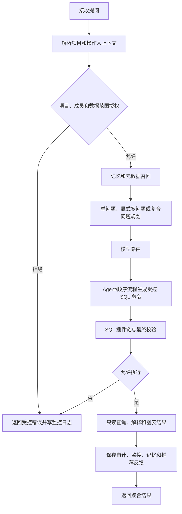
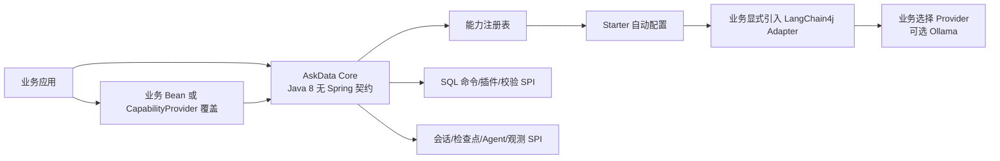
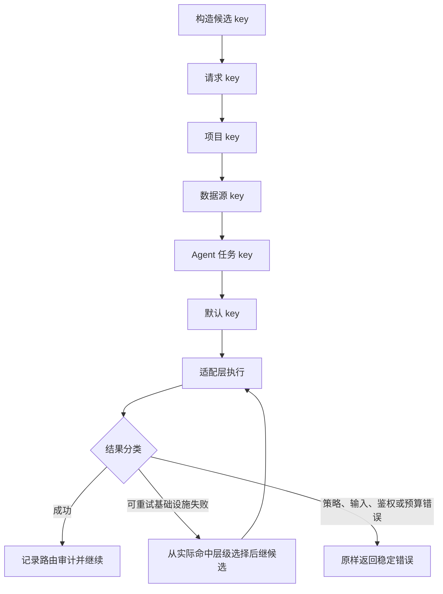
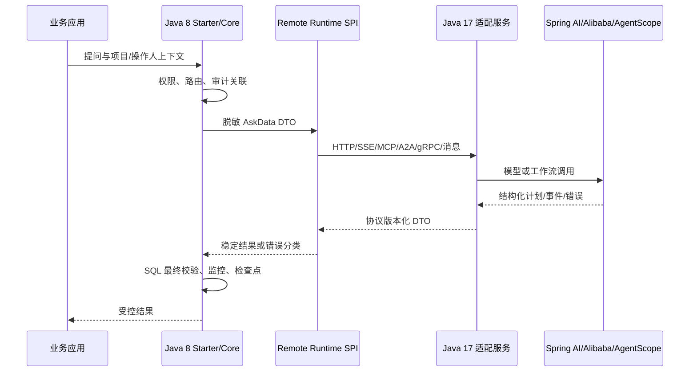
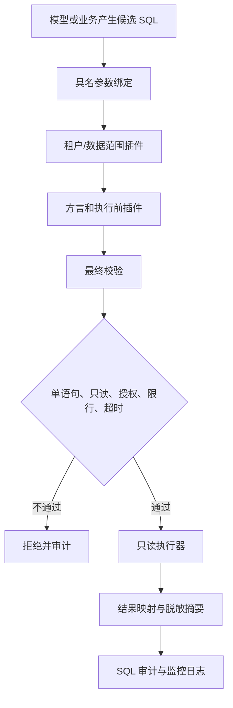
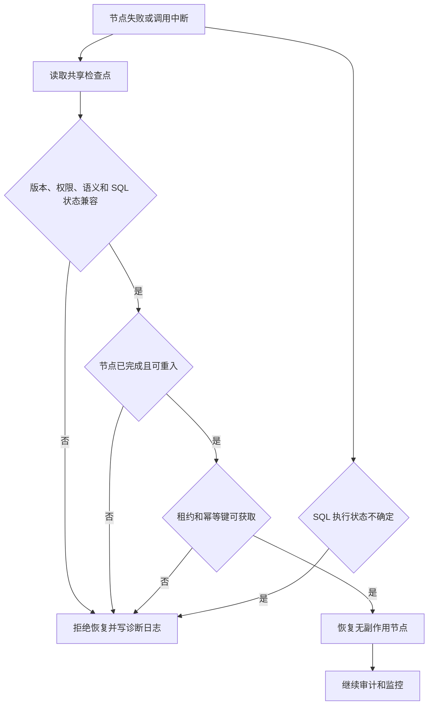
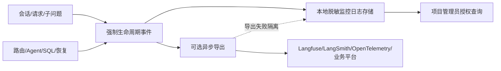
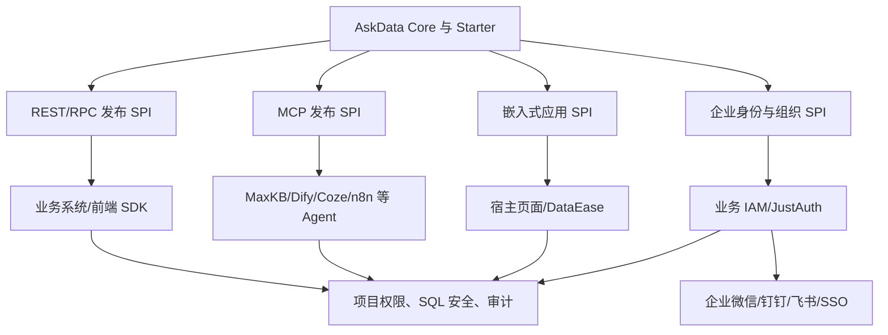

# AskData 流程图

流程图中的“业务扩展”表示可接入接口，不等同于当前 Starter 默认已完成的项目治理、企业集成或远程运行时实现。

## 业务流程

```mermaid
flowchart TD
    A[接收提问] --> B[解析项目和操作人上下文]
    B --> C{项目、成员和数据范围授权}
    C -- 拒绝 --> R[返回受控错误并写监控日志]
    C -- 允许 --> D[记忆和元数据召回]
    D --> E[单问题、显式多问题或复合问题规划]
    E --> F[模型路由]
    F --> G[Agent/顺序流程生成受控 SQL 命令]
    G --> H[SQL 插件链与最终校验]
    H --> I{允许执行}
    I -- 否 --> R
    I -- 是 --> J[只读查询、解释和图表结果]
    J --> K[保存审计、监控、记忆和推荐反馈]
    K --> L[返回聚合结果]
```

## 技术流程

```mermaid
flowchart LR
    App[业务应用] --> Core[AskData Core\nJava 8 无 Spring 契约]
    Core --> Registry[能力注册表]
    Registry --> Starter[Starter 自动配置]
    Starter --> LC4J[业务显式引入 LangChain4j Adapter]
    LC4J --> Provider[业务选择 Provider\n可选 Ollama]
    Core --> Sql[SQL 命令/插件/校验 SPI]
    Core --> State[会话/检查点/Agent/观测 SPI]
    App --> Override[业务 Bean 或 CapabilityProvider 覆盖]
    Override --> Core
```

## 模型 fallback

```mermaid
flowchart TD
    A[构造候选 key] --> B[请求 key]
    B --> C[项目 key]
    C --> D[数据源 key]
    D --> E[Agent 任务 key]
    E --> F[默认 key]
    F --> G[适配层执行]
    G --> H{结果分类}
    H -- 成功 --> I[记录路由审计并继续]
    H -- 可重试基础设施失败 --> J[从实际命中层级选择后继候选]
    J --> G
    H -- 策略、输入、鉴权或预算错误 --> K[原样返回稳定错误]
```

## Java 17 Remote Runtime

```mermaid
sequenceDiagram
    participant U as 业务应用
    participant C as Java 8 Starter/Core
    participant R as Remote Runtime SPI
    participant J as Java 17 适配服务
    participant M as Spring AI/Alibaba/AgentScope
    U->>C: 提问与项目/操作人上下文
    C->>C: 权限、路由、审计关联
    C->>R: 脱敏 AskData DTO
    R->>J: HTTP/SSE/MCP/A2A/gRPC/消息
    J->>M: 模型或工作流调用
    M-->>J: 结构化计划/事件/错误
    J-->>R: 协议版本化 DTO
    R-->>C: 稳定结果或错误分类
    C->>C: SQL 最终校验、监控、检查点
    C-->>U: 受控结果
```

## SQL safety

```mermaid
flowchart TD
    A[模型或业务产生候选 SQL] --> B[具名参数绑定]
    B --> C[租户/数据范围插件]
    C --> D[方言和执行前插件]
    D --> E[最终校验]
    E --> F{单语句、只读、授权、限行、超时}
    F -- 不通过 --> G[拒绝并审计]
    F -- 通过 --> H[只读执行器]
    H --> I[结果映射与脱敏摘要]
    I --> J[SQL 审计与监控日志]
```

## Recovery

```mermaid
flowchart TD
    A[节点失败或调用中断] --> B[读取共享检查点]
    B --> C{版本、权限、语义和 SQL 状态兼容}
    C -- 否 --> D[拒绝恢复并写诊断日志]
    C -- 是 --> E{节点已完成且可重入}
    E -- 否 --> D
    E -- 是 --> F{租约和幂等键可获取}
    F -- 否 --> D
    F -- 是 --> G[恢复无副作用节点]
    G --> H[继续审计和监控]
    A --> I{SQL 执行状态不确定}
    I -- 是 --> D
```

## Monitoring

```mermaid
flowchart LR
    A[会话/请求/子问题] --> L[强制生命周期事件]
    B[路由/Agent/SQL/恢复] --> L
    L --> S[本地脱敏监控日志存储]
    S --> P[项目管理员授权查询]
    L --> E[可选异步导出]
    E --> O[Langfuse/LangSmith/OpenTelemetry/业务平台]
    E -. 导出失败隔离 .-> S
```

## 外部集成

```mermaid
flowchart TB
    Core[AskData Core 与 Starter] --> API[REST/RPC 发布 SPI]
    Core --> MCP[MCP 发布 SPI]
    Core --> Embed[嵌入式应用 SPI]
    Core --> Enterprise[企业身份与组织 SPI]
    API --> Client[业务系统/前端 SDK]
    MCP --> Agent[MaxKB/Dify/Coze/n8n 等 Agent]
    Embed --> Host[宿主页面/DataEase]
    Enterprise --> IdP[业务 IAM/JustAuth]
    IdP --> Platforms[企业微信/钉钉/飞书/SSO]
    Client --> Guard[项目权限、SQL 安全、审计]
    Agent --> Guard
    Host --> Guard
    IdP --> Guard
```
